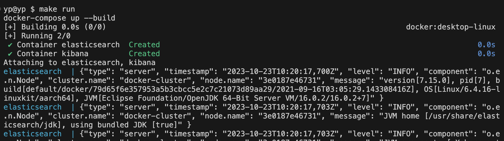
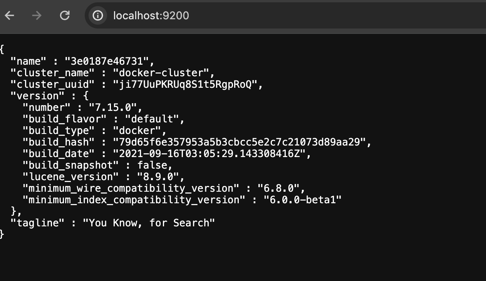
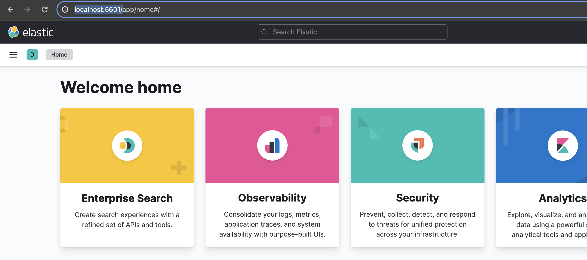
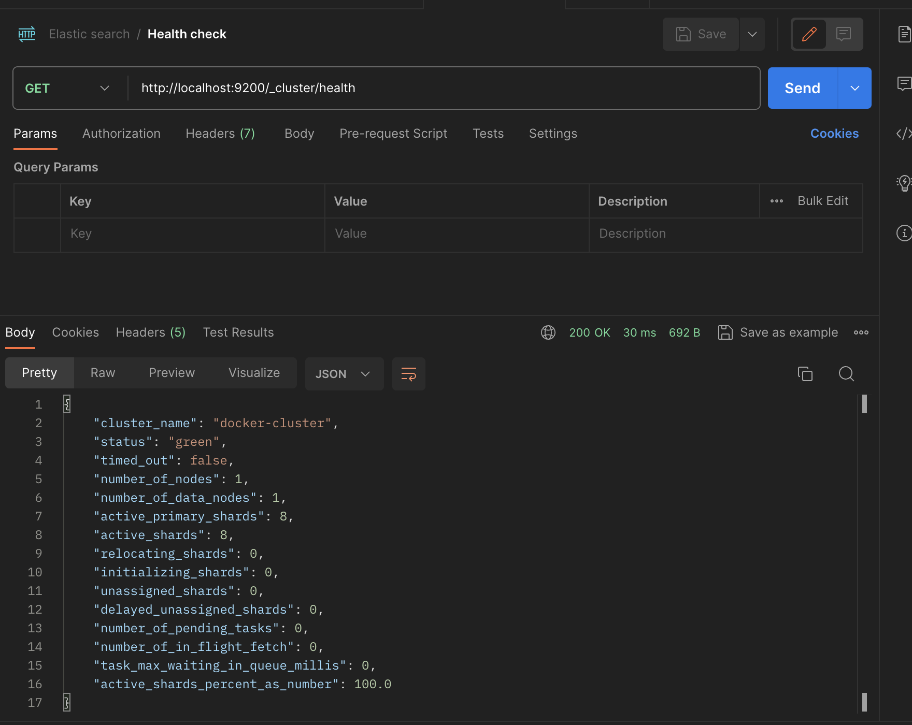

# elasticsearch

## Run the app on the docker
 - Created the docker and docker compose file to run the go code and database into the separate container
```
make run
```


```
http://localhost:9200/
```


```
http://localhost:5601/
```


```
curl --location 'http://localhost:9200/_cluster/health'
```

### Go to the DEV tool and use below commands
```
# Health check document
GET /_cluster/health

#Get all indices
GET _cat/indices

# Get all index data upto 10 results
GET article/_search

#Perform create operation
POST article/_doc/1
{
    "title": "First Article",
    "content": "Lorem ipsum dolor sit amet, consectetur adipiscing elit, sed do eiusmod tempor incididunt ut labore et dolore magna aliqua. Ut enim ad minim veniam, quis nostrud exercitation ullamco laboris nisi ut aliquip ex ea commodo consequat. Duis aute irure dolor in reprehenderit in voluptate velit esse cillum dolore eu fugiat nulla pariatur. Excepteur sint occaecat cupidatat non proident, sunt in culpa qui officia deserunt mollit anim id est laborum.",
    "author": "John"
}

#Get the all article
GET article/_search

# Perform update operation
PUT article/_doc/1
{
    "author": "Yagnik"
}

# Perform delete operation
DELETE article/_doc/1
```